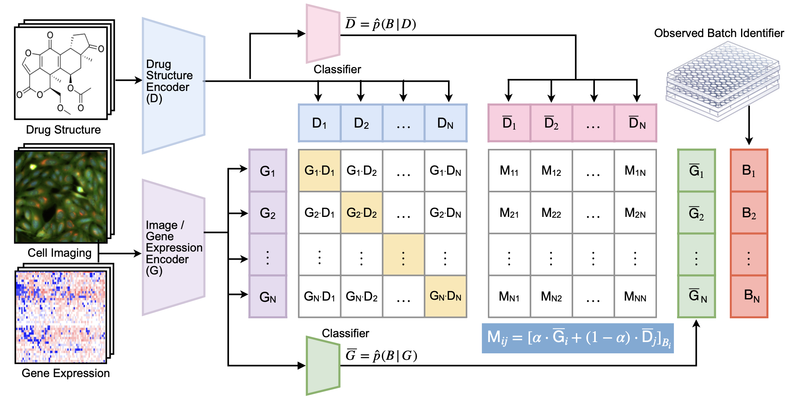

# Removing Biases from Molecular Representations via Information Maximization

The repository contains the code for the `InfoCORE` method presented in the paper ***Removing Biases from Molecular Representations via Information Maximization**, Chenyu Wang, Sharut Gupta, Caroline Uhler, Tommi Jaakkola (2023)*



## Set up the environment

```
conda create -n infocore python=3.10.9
conda activate infocore
bash env.sh
```

## Drug representation experiments
The data used in the drug representation experiments can be downloaded from https://www.dropbox.com/scl/fo/bcj0jf5gacgiapwl33f37/h?rlkey=8eh3v1ilm6r2scgh3mn7syci5&dl=0.

### Gene expression dataset (GE)
1. Data preparation
```
cd GE
mkdir model_save
```
Then add the downloaded data file `GE/data` into the directory `GE`.

2. Model training

The command for `InfoCORE` training can be found in `scripts/script_training.sh`.

3. Model evaluation

The command for the molecule-phenotype retrieval task can be found in `scripts/script_evalacc.sh`; the command for the property prediction task can be found in `scripts/script_finetune.sh`.


### Cell imaging dataset (CP)
1. Data preparation
```
cd CP
mkdir model_save
```
Then add the downloaded data file `CP/data` into the directory `CP`.

2. Model training

The command for `InfoCORE` training can be found in `scripts/script_training.sh`.

3. Model evaluation

The command for the molecule-phenotype retrieval task can be found in `scripts/script_evalacc.sh`; the command for the property prediction task can be found in `scripts/script_finetune.sh`.
